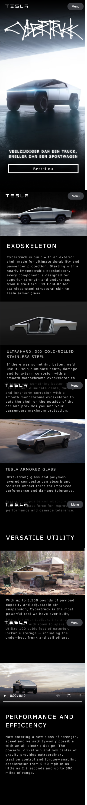

# Procesverslag
Markdown is een simpele manier om HTML te schrijven.  
Markdown cheat cheet: [Hulp bij het schrijven van Markdown](https://github.com/adam-p/markdown-here/wiki/Markdown-Cheatsheet).

Nb. De standaardstructuur en de spartaanse opmaak van de README.md zijn helemaal prima. Het gaat om de inhoud van je procesverslag. Besteedt de tijd voor pracht en praal aan je website.

Nb. Door *open* toe te voegen aan een *details* element kun je deze standaard open zetten. Fijn om dat steeds voor de relevante stuk(ken) te doen.

## Jij

uitwerken voor kick-off werkgroep

### Auteur:
Thomas van der Linden

#### Je startniveau:
Rood

#### Je focus:
Responsive
 

## Je website

uitwerken voor kick-off werkgroep

### Je opdracht:
https://www.tesla.com 

#### Screenshot(s) van de eerste pagina (small screen): 
Tesla - landingpage

#### Screenshot(s) van de tweede pagina (small screen):
Tesla - cypertruck 

 

## Breakdownschets (week 1)

uitwerken na afloop 2e werkgroep

### de hele pagina: 

### dynamisch deel (bijv menu): 

### de hele pagina: 

## Voortgang 1 (week 2)

uitwerken voor 1e voortgang

### Stand van zaken
tot nu toe ging het meeste wel goed, er waren wel een paar dingen waar ik tegen aan liep. Zo werkte de 'scroll snap' eerst niet. Uit eindelijk heb ik dit met behulp van internet toch voor elkaar gekregen. Ook lukte het niet om een afbeelding als achtergrond te maken van een section. Hier was ik uiteindelijk een punt vergeten (bij ../), een kleine domme fout maar heb er wel van geleerd. Daarnaast gebruikte ik eerst erg veel id's als selector voor css. Deze heb ik uiteindelijk allemaal kunnen weg werken. 
Dit is tot nu toe mijn pagina (eerste).

### Agenda voor meeting
samen met je groepje opstellen

*Wij hadden niet zo zeer iets waar wij tegen aan liepen of vragen tot nu toe. 

| student 1      | student 2          | student 3    | student 4        |
| ---            | ---                | ---          | ---              |
| dit bespreken  | en dit             | en ik dit    | en dan ik dat    |
| en dat ook nog | dit als er tijd is | nog een punt | dit wil ik zeker |
| ...            | ...                | ...          | ...              |

### Verslag van meeting
hier na afloop snel de uitkomsten van de meeting vastleggen

Deze week hadden wij niet iets waar wij heel erg tegen aanliepen, tijdens de meeting hebben wij alle 3 onze website doorgelopen en kort door de code gegaan. Hier kwamen tot dus ver nog geen bijzondere dingen uit. 

## Voortgang 2 (week 3)

uitwerken voor 2e voortgang

### Stand van zaken
In week 3 heb ik een grote slag gemaakt, mijn 2e pagina heb ik zo goed als af gemaakt. 

### Agenda voor meeting
Ook hier hadden wij niet een zo zeer een overkoepelend probleem maar allemaal een paar kleine vragen. Ik had bijvoorbeeld een vraag over het gebruik van een div
voor het gebruik van knoppen en het responsive maken hiermee. 

### Verslag van meeting
- Uieindelijk het ik het anders opgelost dan een div. Ik heb gebruik gemaakt van first en nth-of-type.
- Ook bleek dat ik gebruik maakte van een p element in een list item. dit was overbodig. Ook dit heb ik dus aangepast.

## Toegankelijkheidstest (week 4)

uitwerken na test in 8e voortgang

### Bevindingen
Lijst met je bevindingen die in de test naar voren kwamen:

Screenreader leest geen afbeeldingen voor omdat er geen beschrijving bij staat -> dit ook bij het logo. De gebruiker weet hierdoor niet op welke pagina hij zich bevind. 

Door semantische html goed duidelijk wat de koppen zijn.

Bij de video zit ook geen beschrijving, de gebruiker weet niet waar hij naar luistert of wat hij zou moeten zijn. 

Engelse tekst in Nederlandse screenreader klinkt raar.

De 'carrousel' / scrollsnap werkt goed met de screanreader leest gewoon alles voor op de afbeeldingen na.

Ook wanneer je alleen alle kopjes wilt horen

Aandacht test - ballon: Misschien tekst iets groter.
Bril - suikerziekte: menu knop contrast verbeteren, en de textshadow bij tekst (cybertruck) vervalt.

Bril - blur: extshadow bij tekst (cybertruck) vervalt. 

Bril combined loss: alles normaal te zien.

Schokapparaat: Op hoogste stand kan je helemaal niks XD, op aangegeven stand functioneert mijn website wel anders maar het is te doen. Grotere knoppen zouden handig zijn.

#### Alt tekst
Hier korte omschrijving (met indien nodig een afbeelding)

Een alt tekst toevoegen bij de afbeeldingen (en video), dit heb ik ook gedaan.  

#### Korte spanningsboog
Hier korte omschrijving (met indien nodig een afbeelding)

Tijdens de aandacht test bleek dat door dat er weinig aandacht bij de website was sommige teksten / onder kopjes niet goed leesbaar waren.
Deze font grotes zouden dus misschien groter kunnen. Dit heb ik nog niet toegepast.

#### Visuele beperking
Hier korte omschrijving (met indien nodig een afbeelding)

Bij de brillen verschilde het heel erg. Bij de suikerziekte bril was alles zo goed als normaal te lezen. Ook was 
het grappig om te zien dat de tekst shadow verviel bij de eerste p van cybertruck. Dit is niet erg. 

Bij de blur bril daarentegen kon je helemaal niks lezen. Zelf de achtergrond afbeeldingen kon je amper zien. De font grotes zouden hier dus vele malen groter moeten om het leesbaar 
houden. Voor normale mensen is dit echter veel te groot. Misschien zou een speciale knop hiervoor handig zijn zodat mensen met goede ogen maar ook mensen met heel weinig zicht normaal
gebruik van de site kunnen maken.

#### Spierbeperking

Bij het schok apparaat kan je op de hoogste stand helemaal niks XD, op aangegeven stand functioneert mijn website wel anders maar het is te doen. Het scheelt al dat mijn knoppen erg groot zijn. Maar linkjes in de footer en de knoppen naar en in het hamburgermenu zouden groter kunnen. Deze waren moeilijk te bedienen.

## Voortgang 3 (week 4)

uitwerken voor 3e voortgang

### Stand van zaken
In week vier heb ik 

### Agenda voor meeting
Wederom hadden wij deze week allemaal andere problemen, dit waren weer kleine vragen.

Ik had (alweer) een vraag over het div gebruik bij de buttons. Ik twijfelde weer. Uieindelijk kreeg ik het advies om 
een attribute selector te gebruiken. Daarnaast had ik een vraag over de header, door de witte achtergrond kon je het 
witte logo niet altijd goed zien. Ik wilde vanaf een bepaald moment een achtergrond toevoegen bij de header. 

### Verslag van meeting
hier na afloop snel de uitkomsten van de meeting vastleggen

- uiteindelijk heb ik 'het div probleem' weer opgelost met het gebruik van first en nth-of-type.
- De header achtergrond bleek veel makkelijker dan verwacht. Doordat de achtergrond afbeelding al zwart was viel het dus niet 
op als je altijd een zwarte gradiën als achtergrond doet. Dit heb ik dus gedaan.

## Eindgesprek (week 5)

uitwerken voor eindgesprek

### Stand van zaken
De laatste week heb ik erg veel tijd in mijn code gestopt. De basis was goed maar er waren nog wel aardig wat puntjes van aandacht. Zo had ik weinig beschrijving bij mijn code en niet alles was goed geordend. Ik heb ook de beoordelingspunten erbij gepakt en op basis hiervan aanpassingen gedaan in mijn code en dubbel gecheckt of ik overal aan voldeed.

### Screenshot(s)

## Bronnenlijst

continu bijhouden terwijl je werkt

Nb. Wees specifiek ('css-tricks' als bron is bijv. niet specifiek genoeg).

1. bron 1
2. bron 2
3. ...

